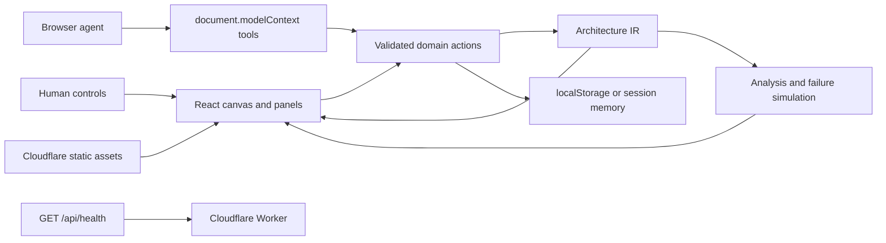

# AetherSketch — Architecture Copilot

**The architecture canvas built for humans and agents.**

AetherSketch gives a human and a browser agent one shared cloud architecture to inspect, improve, and challenge. The human supplies intent and authority; the agent uses typed WebMCP tools; the canvas shows every accepted change and its modeled consequences.

The app does not embed a chatbot, call an LLM API, or access cloud accounts. No OpenAI key, AWS key, or database credentials are needed.

## What it does

Draw a system, set a budget and resilience target, protect important decisions, and ask an agent to improve it. Compare the result with the human-approved starting point, then simulate an availability-zone outage. The same deterministic Architecture IR powers the canvas, tools, analysis, and comparison.

## Why WebMCP

Canvas coordinates and DOM selectors do not describe architectural meaning. WebMCP gives the agent stable component IDs, typed configuration, explicit permissions, and recoverable errors. A layout change does not change the tool contract, and both human and agent actions pass through the same domain validation.

A separate chat UI would add another conversation surface and risk a second representation of the architecture. AetherSketch instead works with the user's existing browser agent on the live page. DOM interaction remains useful for human controls and UI testing; semantic graph operations belong in the tools.

## Human + Agent workflow

1. **Review:** ask the agent to inspect and analyze without modifying the graph.
2. **Constrain:** the human locks PostgreSQL, sets a budget, and chooses a resilience target.
3. **Authorize:** the human enables Agent Edit Mode. A baseline checkpoint is captured.
4. **Improve:** the agent edits through five scoped tools; the canvas and activity update immediately.
5. **Verify:** disable editing, compare before/after metrics and structure, then simulate a failure.

## Features

- Interactive XYFlow canvas, 30 component kinds, Generic labels by default with optional AWS mappings, typed inspectors, and semantic connections.
- Ecommerce, Serverless API, Event Processing, Private Network & Hybrid Access, and blank starting points; validated JSON import/export.
- Virtual networks and subnets, NAT routing, attached security rules, private endpoints, and VPN connections with modeled effects on analysis. See [network modeling and demo](docs/NETWORKING.md).
- Deterministic cost, resilience, security, structural findings, and constraint evaluation.
- Component, availability-zone, and region failure simulations with visible critical-path impact.
- Review/Edit authority, component locks, agent activity, undo/redo, and session comparison.
- Canonical demo reset, copyable prompts, dark/light themes, and local persistence with recovery warnings.

## WebMCP tools

| Name                    | Mode          | Purpose                                                        |
| ----------------------- | ------------- | -------------------------------------------------------------- |
| `get_architecture`      | Review + Edit | Compact graph, IDs, locks, constraints, and cached metrics     |
| `inspect_component`     | Review + Edit | Typed configuration, cost, and relationships for one component |
| `analyze_architecture`  | Review + Edit | Fresh cost, scores, validation, and focused findings           |
| `simulate_failure`      | Review + Edit | Failure impact and surviving critical paths                    |
| `add_component`         | Edit only     | Create a validated catalog component with automatic placement  |
| `update_component`      | Edit only     | Update allowed fields on an unlocked component                 |
| `remove_component`      | Edit only     | Remove an unlocked component and its incident edges            |
| `connect_components`    | Edit only     | Connect existing components with a typed edge                  |
| `disconnect_components` | Edit only     | Remove an existing connection                                  |

Review tools never change Architecture IR. Analysis and simulation update panels and saved activity, so their `readOnlyHint` is false; it is true for get/inspect. All nine responses may contain user/imported labels and carry `untrustedContentHint: true`. See [tool contracts and lifecycle](docs/WEBMCP.md).

## Human authority model

**Review Mode** is the default: only four tools exist. **Agent Edit Mode** adds five mutation tools after registration succeeds. Disabling it revokes execution authority and disposes those registrations; retained callbacks cannot revive in another session.

**Locked components** cannot be updated or removed by an agent. Connections to them can change, allowing an independent replica without altering the protected primary. Only human UI controls can lock/unlock, change constraints, or grant editing.

**Human constraints** such as budget and score targets are soft goals evaluated by analysis. Locks, valid schemas, existing endpoints, and current edit permission are hard invariants. These are application boundaries, not authentication against arbitrary same-origin JavaScript.

## Architecture



The Worker serves health only. Architecture processing happens in the browser, not on a remote inference or infrastructure backend. [Architecture details](docs/ARCHITECTURE.md).

## Technology stack

React, TypeScript, Vite, XYFlow, Zustand, Zod, Tailwind CSS, and Lucide SVG icons. Cloudflare's Vite plugin and Wrangler build/deploy one Worker with static assets. Vitest and Testing Library cover domain, store, tool, and UI behavior.

There are no cloud-provider SDKs, runtime icon downloads, or external font dependencies.

## Local development

Use Node 24 (the verified runtime; minimum 22.12) and npm:

```sh
npm ci
npm run dev
```

Open the URL printed by Vite, normally `http://localhost:5173/`. Local development includes the Worker endpoint. No application environment variables exist, so there is intentionally no `.env.example`.

```sh
npm run format:check
npm run lint
npm run typecheck
npm test
npm run eval:webmcp
npm run test:production
```

`npm test` includes unit/integration tests and ten deterministic WebMCP reference cases. `test:production` builds, starts an isolated Workers preview, checks health/API routing, direct SPA navigation/refresh, asset MIME/cache headers, and closes the server. It is an HTTP smoke test, not a browser e2e or LLM evaluation.

## Testing WebMCP

### ChatGPT in-app browser

Open the app in an in-app browser that exposes WebMCP. Wait for **Ready · Review · 4 tools**, ask for analysis, and verify the panel and Agent activity. Enable editing through the human UI to discover nine tools; disable it to return to four. “Ready” means registration succeeded, not that an agent is connected.

### Chrome WebMCP testing setup

The [current official Chrome instructions](https://developer.chrome.com/docs/ai/webmcp) document `chrome://flags/#enable-webmcp-testing`: enable it, relaunch, and open the app. Browser/version availability varies. The API requires an origin-isolated document and the `tools` permissions policy; production headers retain same-origin tool access. Unsupported browsers still provide the complete human editor.

See [WebMCP testing](docs/WEBMCP.md) and [eval cases and manual model grading](evals/webmcp/README.md). Reference replay is never reported as an LLM success rate.

## WebMCP debugging

The [official DevTools pane](https://developer.chrome.com/docs/devtools/application/webmcp) is **DevTools → Application → WebMCP**. Inspect available/invoked tools, supply arguments, run a tool, and inspect its result or error. The Model Context Tool Inspector is another documented option if that pane is unavailable in your build.

The app's bug-icon diagnostics show mode, registration groups, and the last invocation/result in development. They are excluded from production builds.

## Demo scenario

Use the exact [eleven-step demo script](docs/DEMO.md): reset Ecommerce, analyze in Review Mode, lock PostgreSQL, set **$3,000** and **90 resilience**, request an improvement, then authorize edits. The reference redesign preserves the primary, adds an independent replica and supporting services, and survives loss of `eu-west-1a` with degraded capacity.

| Planning metric          | Reset baseline | Reference redesign |
| ------------------------ | -------------: | -----------------: |
| Components / connections |          5 / 4 |              9 / 8 |
| Monthly cost             |           $675 |             $1,288 |
| Resilience               |             57 |                100 |
| Security                 |             76 |                 90 |

## Architecture analysis model

The Network catalog includes **Internet Gateway** (public routing) and **Virtual Private Gateway** (private connectivity, with a validated private ASN). Both are modeled as regional managed gateways: an individual gateway or its region can fail; they are not global services. Attached networks use explicit subnet routes and separately modeled VPN connections. Their $0 gateway-resource baseline excludes the separate VPN connection estimate, dedicated links and transfer charges. See [network modeling](docs/NETWORKING.md).

**Service labels → Generic** removes generated AWS service names from the palette, canvas, inspector, container launch options, and built-in event/queue protocol labels (including accessible edge names). Cost disclaimers and protocol hints are provider neutral. This is a display preference: it preserves component names, user-entered settings, provider identifiers, exported IR, and agent tool data. It does not convert an existing AWS architecture to another provider. New components whose actual provider is Generic use generic service identifiers.

Costs come from catalog baselines and a small set of configuration multipliers. They omit usage volume, traffic, regional price sheets, discounts, and taxes. **They are planning estimates, not provider quotes.** Scores expose deterministic structural rules, not an SLA, compliance certification, or security scan.

Simulation projects graph reachability and modeled redundancy. It does not predict recovery time, remaining capacity, replication lag, or data loss. [Rules and limitations](docs/ANALYSIS.md).

## Security

Tools use strict schemas, bounded input traversal, kind validation, current permission checks, and domain validation. Imported text stays data and is rendered with React escaping. Notes/metadata and UI/history are omitted from graph tool output; remaining returned names and labels are untrusted.

Architecture, history, and activity live in unencrypted localStorage. If storage becomes unavailable/full, the editor continues in memory and warns the user to export before closing. Invalid imports preserve the current project; analysis and render failures offer recovery. Never enter secrets. Read [SECURITY.md](SECURITY.md) and the [authority model](docs/SECURITY.md).

## Deployment

One Cloudflare Worker serves the SPA assets and `/api/health` from one public origin. The [Cloudflare Vite integration](https://developers.cloudflare.com/workers/vite-plugin/tutorial/) generates the deploy configuration; do not hand-edit `dist/` or deploy only the client directory.

```sh
npm run build
npm run preview
# One-time owner authentication, if not already logged in:
npx wrangler login
# Review the Cloudflare account and Worker name, then publish:
npm run deploy
```

`npm run deploy` rebuilds and publishes the Worker and assets together. No application secrets or database bindings are required; the repository owner needs Cloudflare deployment authorization. Build-only validation is available with `npx wrangler deploy --dry-run` after a build.

SPA fallback serves direct page navigation and refresh. `/api` and `/api/*` run the Worker first, so unknown APIs return JSON 404s rather than the SPA. Hashed assets receive immutable caching; the favicon is bundled locally.

After deployment, open the URL printed by Wrangler, refresh a nested page, and confirm `GET /api/health` returns `{"status":"ok","service":"aethersketch"}`. See [deployment and release checks](docs/DEPLOYMENT.md). A public URL must be verified before claiming a live deployment.

## Repository structure

```text
src/architecture/   IR, catalog, validation, analysis, comparison, simulation
src/components/     Canvas, inspectors, panels, controls, recovery UI
src/stores/         Architecture/history, intelligence, theme, UI state
src/webmcp/         Tool schemas, outputs, authority, registration lifecycle
src/templates/      Canonical demo and alternative starting architectures
worker/             Health endpoint
public/             Favicon and production asset headers
scripts/            Production HTTP smoke test
tests/              Unit and integration coverage
evals/webmcp/       Ten deterministic cases and manual LLM evaluation guide
docs/               Architecture, tools, security, demo, analysis, deployment
```

## Limitations

Desktop workspace (minimum 1000×640); dense graphs need zoom and sidebar scrolling. State is local to one browser origin; no collaboration or cross-device sync. Large graph outputs can exceed advisory agent context budgets. WebMCP remains an evolving browser API. No real infrastructure is deployed or managed by the product.

## Roadmap

Potential follow-ups include richer provider pricing assumptions, stronger capacity modeling, accessible keyboard graph editing, and real model-evaluation runs across supported browsers. These are not implemented features or promises of current behavior.

## License

[GNU Affero General Public License v3.0 or later](LICENSE), SPDX `AGPL-3.0-or-later`. The repository's established open-source license is preserved.
